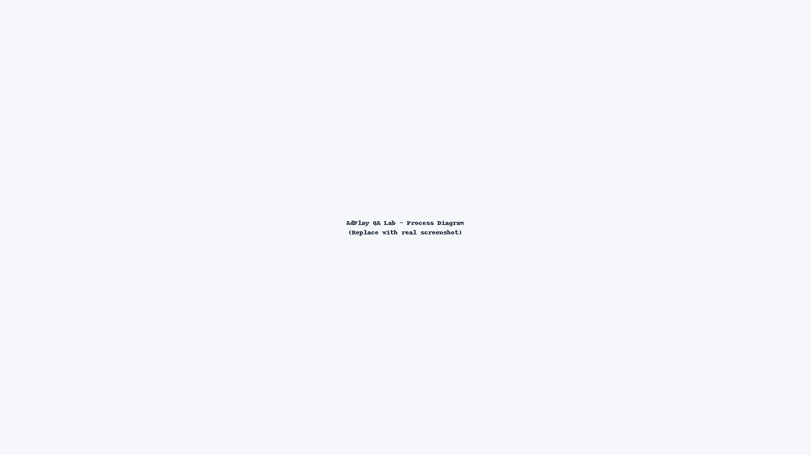
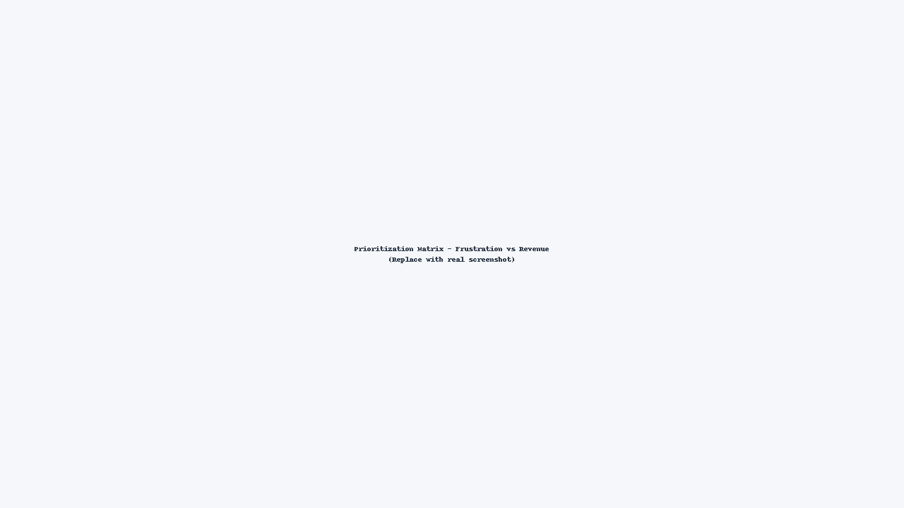
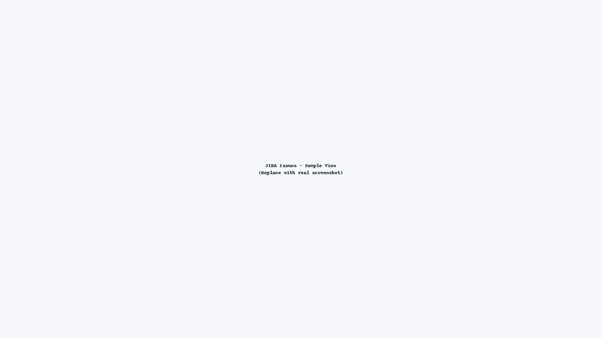
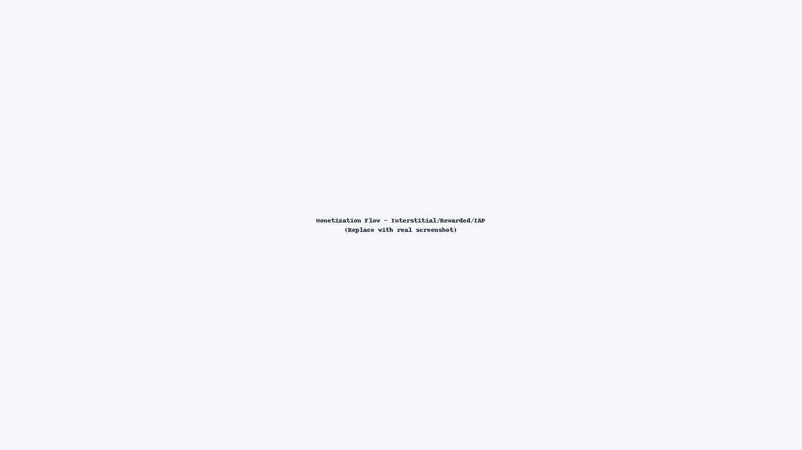

# AdPlay QA Lab – Monetization & UX Testing for Casual Games

[]()
[]()
[]()
[]()

**Timeframe:** Jan 2025 – Feb 2025  
**Platforms:** Android & iOS  
**Builds:** 1.3.7 (1037)

---

## 🎯 Goals
- Design and validate **cross-platform test cases** targeting monetization funnels (Interstitial, Rewarded Video, IAP) and **session stability & UX immersion**.  
- Build an **Excel prioritization framework** linking defects to *player frustration* and *revenue loss*, accelerating fix cycles by ~25%.  
- Document **reproducible issues in JIRA** with severity & business impact, improving usability ratings by ~30% after fixes.

---

## 🧭 Architecture / Process



**Flow:** Test Strategy → Device Matrix → Test Execution (Android/iOS via Appium) → JIRA logging → Prioritization Matrix (Excel) → Allure QA Report → Dev Fixes → Re-test & Sign-off

---

## 📦 Repo Layout

```
AdPlay-QA-Lab/
├─ automation/                 # Appium + PyTest skeleton
│  ├─ android/
│  ├─ ios/
│  └─ conftest.py
├─ testcases/
│  ├─ test_cases.xlsx
│  ├─ prioritization_framework.xlsx
│  └─ jira_export_sample.csv
├─ scripts/
│  └─ generate_prioritization_report.py
├─ assets/screenshots/         # Replace placeholders with real images
├─ docs/architecture.png
├─ reports/                    # Allure output (generated)
├─ .github/workflows/ci.yml
├─ requirements*.txt, Makefile, LICENSE, README.md
└─ .gitignore
```

---

## ⚙️ Quickstart

```bash
make setup
make test           # runs sample tests & generates Allure results
make report         # builds prioritized_defects.csv/html from Excel
```

> To open Allure locally: `allure serve reports/allure`

---

## 🧪 Device Matrix (sample)

| OS      | Version | Device   | Notes                          |
|---------|---------|----------|--------------------------------|
| Android | 12–14   | Pixel 6/7 | 120Hz, in-app back stack        |
| iOS     | 16–17   | iPhone 13/14 | ATT prompts, system dialogs |

---

## 📊 Prioritization Framework

The Excel (`testcases/prioritization_framework.xlsx`) scores each defect on **Player Frustration** and **Revenue Loss** (1–5).  
Weighted Score = `0.6*RevenueLoss + 0.4*Frustration` → sorts items into **Top-Fix Queue**.

We also auto-generate reports via `scripts/generate_prioritization_report.py`.



---

## 📝 JIRA Workflow

1. Add repro steps, environment, build number.  
2. Attach evidence (screenshots, logs).  
3. Assign Severity (S1–S4) + Business Impact tag (`Revenue`, `Retention`, `Session`).  
4. Link to test case ID.  
5. After fix, re-test & close.



---

## 🕹️ Monetization Flows Covered

- **Interstitial Ads:** Frequency capping, skip timing, accidental clicks.  
- **Rewarded Video:** Availability, reward payout, network fallback.  
- **In-App Purchases:** Price localization, restore purchases, edge cases.



---

## ✅ Outcomes

- **40+ monetization defects** uncovered across Android/iOS builds.  
- **25% faster fix cycles** by prioritizing high-impact items.  
- **~30% usability rating improvement** post-fix.

---

## 🤝 Recruiter Note

This repo demonstrates **business-aware QA**: monetization + UX focus, automation hooks, prioritization frameworks, and actionable reporting. A practical lab that mirrors real-world QA consulting impact.
